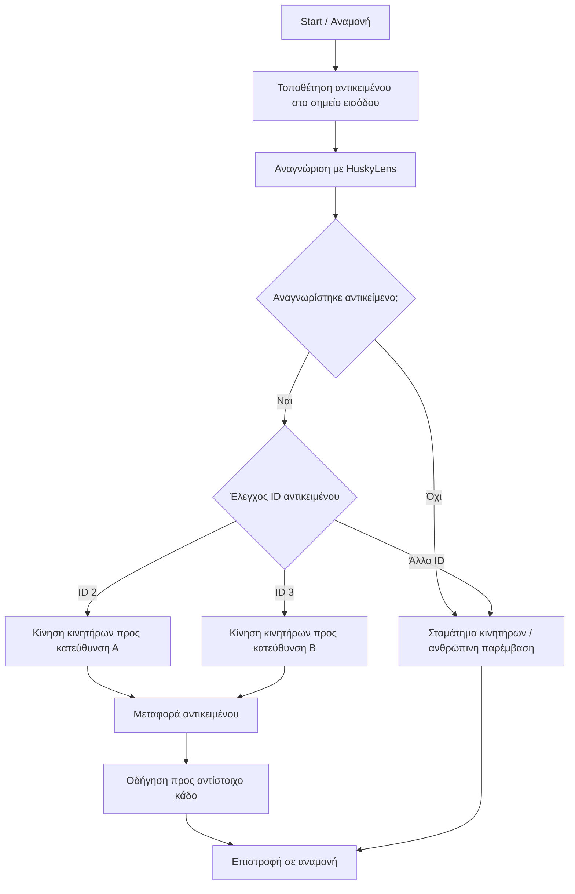

# ♻️ Auto-Recycle

**Εκπαιδευτικό σύστημα αυτόματης διαλογής ανακυκλώσιμων υλικών με AI όραση μέσω HuskyLens και έλεγχο DC κινητήρων με L293D**

---

## 1. Σύντομη περιγραφή

Το **Auto-Recycle** είναι ένα εκπαιδευτικό, αυτοματοποιημένο πρωτότυπο διαλογής ανακυκλώσιμων υλικών. Το έργο δημιουργήθηκε από μαθητές Γυμνασίου με στόχο να συνδέσει την ανακύκλωση, τους αυτοματισμούς, την τεχνητή όραση και τη ρομποτική κατασκευή σε μια πρακτική σχολική εφαρμογή.

Ο χρήστης τοποθετεί ένα αντικείμενο στο σημείο εισόδου της μακέτας. Η κάμερα **Gravity HuskyLens** αναγνωρίζει το αντικείμενο ή την κατηγορία του, όπως πλαστικό, χαρτί ή μέταλλο, και στη συνέχεια ο μικροελεγκτής ενεργοποιεί DC κινητήρες μέσω οδηγού **L293D**, ώστε το αντικείμενο να μετακινηθεί προς την κατάλληλη κατεύθυνση διαλογής.

Το έργο είναι εκπαιδευτικό πρωτότυπο και όχι βιομηχανικό σύστημα διαλογής απορριμμάτων. Στόχος του είναι να βοηθήσει τους μαθητές να κατανοήσουν τη λογική ενός αυτοματοποιημένου συστήματος, τους μηχανικούς περιορισμούς μιας κατασκευής και τη σημασία της σωστής ανακύκλωσης.

---

## 2. Κατάσταση έργου

**Κατάσταση:** Ολοκληρωμένο εκπαιδευτικό πρωτότυπο με καταγεγραμμένο τεχνικό περιορισμό στο σύστημα μεταφοράς.

Η μακέτα κατασκευάστηκε και τα βασικά μέρη του συστήματος υλοποιήθηκαν:

* κατασκευή κάδων και μηχανισμού διαλογής,
* χρήση HuskyLens για αναγνώριση αντικειμένων,
* χρήση Arduino / συμβατού μικροελεγκτή,
* χρήση οδηγού L293D για έλεγχο DC κινητήρων,
* πειραματισμός με μηχανισμό μεταφοράς,
* δημιουργία κώδικα σε περιβάλλον Mind+,
* δοκιμές με διαφορετικές κατηγορίες αντικειμένων,
* καταγραφή τεχνικών δυσκολιών και προτάσεων βελτίωσης.

Στην τελική φάση χρησιμοποιήθηκαν **DC κινητήρες** με οδηγό **L293D** για το σύστημα μεταφοράς. Κατά τις δοκιμές διαπιστώθηκε ότι οι κινητήρες δεν είχαν αρκετή δύναμη για πλήρως σταθερή λειτουργία με το βάρος, τις τριβές και τη μορφή της μακέτας. Το εύρημα αυτό καταγράφηκε ως τεχνικός περιορισμός του πρωτοτύπου και ως βάση για μελλοντική βελτίωση με ισχυρότερους geared motors ή διαφορετικό μηχανισμό μετάδοσης.

---

## 3. Εκπαιδευτικός σκοπός

Το Auto-Recycle σχεδιάστηκε ώστε οι μαθητές να κατανοήσουν:

* τη σημασία της ανακύκλωσης,
* την ανάγκη σωστής διαλογής απορριμμάτων,
* τη λειτουργία αισθητήρων και ενεργοποιητών,
* τη βασική λογική ενός αυτοματοποιημένου συστήματος,
* τη χρήση AI κάμερας σε πρακτικό σχολικό έργο,
* τη σύνδεση λογισμικού και μηχανικής κατασκευής,
* τον έλεγχο DC κινητήρων μέσω motor driver,
* τη σημασία της τροφοδοσίας, της ροπής και των τριβών,
* τη διαδικασία δοκιμών, αποτυχιών και επανασχεδιασμού.

Το έργο δείχνει ότι η τεχνολογία μπορεί να αξιοποιηθεί όχι μόνο για επίδειξη, αλλά και για την κατανόηση πραγματικών περιβαλλοντικών προβλημάτων.

---

## 4. Πρόβλημα που επιχειρεί να προσομοιώσει

Η ανακύκλωση απαιτεί σωστή διαλογή των υλικών. Στην πράξη, πολλά ανακυκλώσιμα αντικείμενα καταλήγουν σε λάθος κάδους ή απορρίπτονται χωρίς ταξινόμηση.

Το Auto-Recycle προσομοιώνει ένα απλό σύστημα αυτόματης διαλογής, όπου η αναγνώριση ενός αντικειμένου οδηγεί σε μηχανική επιλογή της κατάλληλης κατεύθυνσης.

Το σχολικό πρωτότυπο δεν επιδιώκει να αντικαταστήσει πραγματικά συστήματα ανακύκλωσης. Λειτουργεί ως εκπαιδευτική μακέτα για να κατανοήσουν οι μαθητές τη ροή:

**αναγνώριση → απόφαση → εντολή στον μικροελεγκτή → κίνηση κινητήρων → διαλογή**

---

## 5. Πώς λειτουργεί

Η βασική λειτουργία του συστήματος είναι η εξής:

1. Ο χρήστης τοποθετεί ένα αντικείμενο στο σημείο εισόδου.
2. Η κάμερα HuskyLens αναγνωρίζει το αντικείμενο ή την κατηγορία του.
3. Ο μικροελεγκτής λαμβάνει την πληροφορία αναγνώρισης.
4. Το πρόγραμμα ελέγχει το αναγνωρισμένο ID.
5. Αν αναγνωριστεί συγκεκριμένο ID, ενεργοποιούνται οι DC κινητήρες μέσω L293D.
6. Οι κινητήρες κινούν το σύστημα μεταφοράς προς την αντίστοιχη κατεύθυνση.
7. Αν δεν αναγνωριστεί κατάλληλο αντικείμενο, οι κινητήρες σταματούν.
8. Το σύστημα επιστρέφει σε κατάσταση αναμονής.

---

## 6. Βασική αρχιτεκτονική συστήματος

### 6.1 Αντίληψη

* Gravity HuskyLens AI Camera
* Λειτουργία Object Classification
* Αναγνώριση εκπαιδευμένων αντικειμένων / κατηγοριών
* Εξάρτηση από φωτισμό, θέση αντικειμένου και γωνία κάμερας

### 6.2 Έλεγχος

* Arduino UNO ή συμβατός μικροελεγκτής
* Πρόγραμμα σε περιβάλλον Mind+
* Λογική ελέγχου με βάση τα ID που επιστρέφει η HuskyLens

### 6.3 Κίνηση / μεταφορά

* DC motors
* L293D motor driver
* Ροδέλες / μηχανισμός μεταφοράς
* Τροφοδοσία χαμηλής τάσης

### 6.4 Διαλογή

* Μηχανισμός μεταφοράς προς διαφορετικές κατευθύνσεις
* Κάδοι συλλογής για διαφορετικές κατηγορίες υλικών
* Δυνατότητα μελλοντικής χρήσης servo motors ή ισχυρότερων geared motors για πιο αξιόπιστη διαλογή

---

## 7. Ροή λειτουργίας



---

## 8. Βασικός αλγόριθμος

```text
1. Εκκίνηση συστήματος.
2. Αρχικοποίηση HuskyLens.
3. Αρχικοποίηση pins για τον οδηγό L293D.
4. Αναμονή για αντικείμενο στο σημείο εισόδου.
5. Η HuskyLens λειτουργεί σε Object Classification mode.
6. Το πρόγραμμα ζητά συνεχώς δεδομένα από τη HuskyLens.
7. Αν αναγνωριστεί αντικείμενο με ID 2:
   - ενεργοποιούνται οι κινητήρες προς μία κατεύθυνση.
8. Αν αναγνωριστεί αντικείμενο με ID 3:
   - ενεργοποιούνται οι κινητήρες προς διαφορετική κατεύθυνση.
9. Αν δεν αναγνωριστεί κατάλληλο αντικείμενο:
   - οι κινητήρες σταματούν.
10. Το σύστημα επιστρέφει σε κατάσταση αναμονής.
```

---

## 9. Κώδικας

Ο κώδικας του έργου αναπτύχθηκε σε περιβάλλον **Mind+ / block programming** και αποθηκεύτηκε ως αρχείο project.

Προτεινόμενη θέση στο αποθετήριο:

```text
code/SUPER_DUPER_MindPlus_Project.mp
```

ή, αν κρατηθεί το αρχικό όνομα:

```text
code/SUPER DUPER.mp
```

Το αρχείο περιέχει το πρόγραμμα που συνδέει τη λειτουργία της HuskyLens με τον έλεγχο των DC κινητήρων μέσω του L293D.

Η HuskyLens χρησιμοποιείται σε λειτουργία **Object Classification**. Το πρόγραμμα ζητά συνεχώς δεδομένα από την κάμερα και ελέγχει αν έχει αναγνωριστεί αντικείμενο συγκεκριμένης κατηγορίας. Στην υλοποίηση χρησιμοποιήθηκαν οι κατηγορίες **ID 2** και **ID 3**, οι οποίες αντιστοιχούν σε διαφορετικές αποφάσεις κίνησης / διαλογής.

---

## 10. Αντιστοίχιση pins L293D και κινητήρων

Για τον έλεγχο των κινητήρων μέσω L293D χρησιμοποιήθηκε η παρακάτω λογική αντιστοίχιση:

| Λειτουργία           | Pin |
| -------------------- | --- |
| Motor A input 1      | D2  |
| Motor A input 2      | D4  |
| Motor A PWM / Enable | D9  |
| Motor B input 1      | D7  |
| Motor B input 2      | D8  |
| Motor B PWM / Enable | D3  |

Συνοπτικά:

```text
Motor A: D2, D4, PWM 9
Motor B: D7, D8, PWM 3
```

Όταν η HuskyLens αναγνωρίζει αντικείμενο με **ID 2**, οι κινητήρες ενεργοποιούνται προς μία κατεύθυνση.
Όταν αναγνωρίζει αντικείμενο με **ID 3**, οι κινητήρες ενεργοποιούνται με διαφορετική φορά ή ρύθμιση.
Όταν δεν αναγνωρίζεται σχετικό αντικείμενο, οι κινητήρες σταματούν.

---

## 11. Υλικά

### Βασικά υλικά

| Υλικό                                | Χρήση                                         |
| ------------------------------------ | --------------------------------------------- |
| Gravity HuskyLens AI Camera          | Αναγνώριση αντικειμένων                       |
| Arduino UNO ή συμβατός μικροελεγκτής | Κεντρικός έλεγχος                             |
| L293D motor driver                   | Οδήγηση DC κινητήρων                          |
| DC motors                            | Μηχανισμός μεταφοράς                          |
| Servo motors                         | Μελλοντική ή εναλλακτική χρήση για push walls |
| Breadboard                           | Δοκιμαστικές συνδέσεις                        |
| Jumper wires                         | Καλωδίωση                                     |
| LEDs και αντιστάσεις                 | Ενδείξεις / δοκιμές                           |
| Τροφοδοσία                           | Παροχή ρεύματος                               |
| Χαρτόνι / ξύλο / MDF                 | Κατασκευή μακέτας και κάδων                   |
| Κόλλα, βίδες, δεματικά               | Συναρμολόγηση                                 |

### Προαιρετικά υλικά

* ισχυρότεροι geared motors,
* διαφορετικός motor driver με μεγαλύτερη δυνατότητα ρεύματος,
* end-stop / microswitch,
* καλύτερο σύστημα ράγας ή ιμάντα,
* ανεξάρτητη τροφοδοσία κινητήρων,
* servo-based push walls,
* οδηγοί αντικειμένων για σταθερότερη μεταφορά.

---

## 12. Ανάλυση κόστους

Ο παρακάτω πίνακας παρουσιάζει το συνολικό κόστος υλοποίησης, αν αγοραστούν όλα τα υλικά από την αρχή, καθώς και το πραγματικό κόστος για το σχολείο, δεδομένου ότι υπήρχε ήδη βασικός εξοπλισμός STEM.

| Item                                       | Ποσότητα | Μέση τιμή/τεμ. (€) | Κόστος αν αγοραστούν όλα (€) | Πραγματικό κόστος (€) |
| ------------------------------------------ | -------: | -----------------: | ---------------------------: | --------------------: |
| Gravity HuskyLens AI Camera                |        1 |              69,99 |                        69,99 |                 69,99 |
| Arduino UNO ή ESP32                        |        1 |              30,00 |                        30,00 |                  0,00 |
| L293D motor driver                         |        1 |               3,00 |                         3,00 |                  0,00 |
| Servo motors                               |        3 |               5,00 |                        15,00 |                  0,00 |
| DC motors / ροδέλες / τροχοί               |    1 σετ |               8,00 |                         8,00 |                  0,00 |
| L-shaped DC Gear Motor with Encoder 240RPM |        1 |              12,80 |                        12,80 |                 12,80 |
| Breadboard                                 |        1 |               7,00 |                         7,00 |                  0,00 |
| Jumper wires                               |    1 σετ |               4,00 |                         4,00 |                  0,00 |
| Τροφοδοσία / USB καλώδιο                   |        1 |               7,00 |                         7,00 |                  0,00 |
| LEDs, αντιστάσεις, μικροϋλικά              |    1 σετ |               6,00 |                         6,00 |                  0,00 |
| Υλικά μακέτας                              |        — |              10,00 |                        10,00 |                 10,00 |
| **Σύνολο**                                 |          |                    |                 **172,79 €** |           **92,79 €** |

Το έργο μπορεί να αναπαραχθεί από οποιοδήποτε σχολείο με κόστος περίπου **170–175 €**, ενώ για σχολικές μονάδες που διαθέτουν ήδη βασικό εξοπλισμό STEM, το επιπλέον κόστος περιορίζεται περίπου στα **90 €**.

---

## 13. Τεχνικός περιορισμός που καταγράφηκε

Κατά τις δοκιμές του συστήματος μεταφοράς χρησιμοποιήθηκαν DC κινητήρες με οδηγό L293D. Η σύνδεση λειτούργησε σε επίπεδο ελέγχου, όμως οι κινητήρες δεν είχαν αρκετή δύναμη για σταθερή μεταφορά αντικειμένων πάνω στη μακέτα.

Το πρόβλημα οφείλεται κυρίως σε:

* αυξημένη τριβή στη διαδρομή,
* βάρος αντικειμένων,
* περιορισμένη ροπή των διαθέσιμων DC κινητήρων,
* περιορισμούς του μηχανισμού μετάδοσης,
* ανάγκη για καλύτερη τροφοδοσία,
* ανάγκη για ισχυρότερη μηχανική στήριξη.

Η λύση για επόμενη έκδοση είναι η χρήση ισχυρότερων geared motors, καλύτερου συστήματος ράγας/ιμάντα ή μηχανισμού διαλογής με servo που δεν απαιτεί συνεχή μεταφορά.

Το σημείο αυτό αποτελεί σημαντικό μαθησιακό αποτέλεσμα, επειδή έδειξε στους μαθητές ότι ένα ρομποτικό σύστημα δεν εξαρτάται μόνο από τον κώδικα, αλλά και από τη μηχανική ισχύ, τις τριβές, την τροφοδοσία και τη συνολική κατασκευή.

---

## 14. Δοκιμές

Οι βασικές δοκιμές που πραγματοποιήθηκαν ή προβλέπονται είναι:

| Δοκιμή                               | Αναμενόμενο αποτέλεσμα                    |
| ------------------------------------ | ----------------------------------------- |
| Αναγνώριση αντικειμένου με HuskyLens | Εμφάνιση σωστής κατηγορίας / ID           |
| Αναγνώριση ID 2                      | Κίνηση κινητήρων προς κατεύθυνση Α        |
| Αναγνώριση ID 3                      | Κίνηση κινητήρων προς κατεύθυνση Β        |
| Μη αναγνωρίσιμο αντικείμενο          | Σταμάτημα κινητήρων ή ανθρώπινη παρέμβαση |
| Ενεργοποίηση DC motor                | Κίνηση συστήματος μεταφοράς               |
| Δοκιμή L293D                         | Έλεγχος φοράς και ταχύτητας κινητήρων     |
| Δοκιμή με βαρύτερο αντικείμενο       | Έλεγχος ορίων ισχύος κινητήρα             |
| Δοκιμή με διαφορετικό φωτισμό        | Έλεγχος αξιοπιστίας αναγνώρισης           |
| Δοκιμή επαναφοράς                    | Επιστροφή σε κατάσταση αναμονής           |

---

## 15. Φωτογραφίες και βίντεο από στάδια εργασίας

Στο αποθετήριο μπορούν να προστεθούν φωτογραφίες και βίντεο από διαφορετικά στάδια της εργασίας.

Προτεινόμενος φάκελος:

```text
media/
```


```

Σε δημόσια ανάρτηση πρέπει να αποφεύγεται η εμφάνιση προσώπων μαθητών, εκτός αν υπάρχουν οι απαραίτητες άδειες. Προτείνεται οι φωτογραφίες και τα βίντεο να δείχνουν κυρίως τη μακέτα, τα χέρια των μαθητών, το κύκλωμα, τον υπολογιστή και τα εξαρτήματα.

---

## 16. Περιορισμοί και ρεαλισμός

Το Auto-Recycle είναι εκπαιδευτικό πρωτότυπο και έχει συγκεκριμένους περιορισμούς:

* δεν είναι βιομηχανικό σύστημα διαλογής,
* η αναγνώριση εξαρτάται από τον φωτισμό,
* η αναγνώριση επηρεάζεται από τη γωνία της κάμερας,
* αντικείμενα με παρόμοια εμφάνιση μπορεί να μπερδευτούν,
* το σύστημα μεταφοράς χρειάζεται ισχυρότερους κινητήρες για σταθερή χρήση,
* το L293D είναι κατάλληλο για απλές σχολικές δοκιμές, αλλά όχι για απαιτητικό μηχανικό φορτίο,
* απαιτείται καλύτερη μηχανική κατασκευή για επαναλαμβανόμενη λειτουργία.

---

## 17. Θέματα ασφάλειας

Για την ασφαλή χρήση του πρωτοτύπου:

* χρησιμοποιείται χαμηλή τάση,
* οι μαθητές εργάζονται με επίβλεψη εκπαιδευτικού,
* αποσυνδέεται η τροφοδοσία πριν από αλλαγές στη συνδεσμολογία,
* αποφεύγεται η επαφή με κινούμενα μέρη,
* τα δάχτυλα δεν τοποθετούνται κοντά σε τροχούς, ροδέλες ή ωθητήρες,
* η μακέτα χρησιμοποιείται μόνο για εκπαιδευτικούς σκοπούς.

---

## 18. Εκπαιδευτικά ερωτήματα

Το έργο μπορεί να αξιοποιηθεί με φύλλα εργασίας γύρω από ερωτήματα όπως:

* Γιατί είναι σημαντική η σωστή διαλογή ανακυκλώσιμων υλικών;
* Πώς μπορεί μια AI κάμερα να βοηθήσει στην ταξινόμηση αντικειμένων;
* Ποια είναι τα όρια της τεχνητής όρασης;
* Γιατί ένας κινητήρας μπορεί να λειτουργεί ηλεκτρικά αλλά να μην έχει αρκετή μηχανική δύναμη;
* Τι ρόλο παίζουν η τριβή, η ροπή και το βάρος σε μια ρομποτική κατασκευή;
* Πώς λειτουργεί ένας οδηγός κινητήρων όπως το L293D;
* Πώς θα μπορούσε να βελτιωθεί το σύστημα μεταφοράς;
* Ποια είναι η διαφορά ανάμεσα σε σχολικό πρωτότυπο και πραγματικό βιομηχανικό σύστημα;

---

## 19. Σύνδεση με ανοιχτές τεχνολογίες και κοινό καλό

Το Auto-Recycle συνδέεται με τις ανοιχτές τεχνολογίες και το κοινό καλό επειδή:

* χρησιμοποιεί εκπαιδευτικό hardware που μπορεί να επαναχρησιμοποιηθεί,
* μπορεί να τεκμηριωθεί δημόσια,
* μπορεί να αναπαραχθεί από άλλες σχολικές ομάδες,
* συνδέει τη ρομποτική με περιβαλλοντικό πρόβλημα,
* βοηθά τους μαθητές να κατανοήσουν την ανακύκλωση μέσα από πράξη,
* καλλιεργεί τεχνολογική, περιβαλλοντική και συνεργατική σκέψη.

Το έργο δείχνει ότι η τεχνολογία μπορεί να χρησιμοποιηθεί ως εργαλείο περιβαλλοντικής εκπαίδευσης και όχι μόνο ως τεχνική άσκηση.

---

## 20. Μελλοντικές βελτιώσεις

Πιθανές επεκτάσεις του έργου:

* χρήση ισχυρότερων geared motors,
* χρήση διαφορετικού motor driver με μεγαλύτερη δυνατότητα ρεύματος,
* ανεξάρτητη τροφοδοσία κινητήρων,
* αντικατάσταση της μεταφοράς με servo-based μηχανισμό επιλογής,
* καλύτερος μηχανισμός ράγας ή ιμάντα,
* προσθήκη end-stops,
* καλύτερη στήριξη HuskyLens,
* σταθερός φωτισμός στο σημείο αναγνώρισης,
* περισσότερες κατηγορίες ανακυκλώσιμων υλικών,
* reject κάδος για μη αναγνωρίσιμα αντικείμενα,
* καλύτερη τεκμηρίωση δοκιμών,
* πιο ανθεκτική κατασκευή από ξύλο ή MDF.

---

## 21. Ομάδα έργου

**Σχολείο / Φορέας:** ΙΔΡΥΜΑ ΣΤΑΜΑΤΙΟΥ
**Σχολική ομάδα:** Μαθητές Α–Γ Γυμνασίου
**Υπεύθυνος εκπαιδευτικός:** ΧΙΩΤΕΛΗΣ ΑΡΗΣ

### Μαθητές

* Αχμάντ Ηλίας
* Καραγιάννης Πριέτο Δημήτριος
* Καστανάκη Μαρία Αγγελική
* Μαραγκός Φίλιππος
* Κιαουρτζή Χρυσοβαλάντω

---

## 22. Άδειες χρήσης

Το λογισμικό του έργου διατίθεται με άδεια:

**MIT License**

Το εκπαιδευτικό υλικό, η τεκμηρίωση, τα σχέδια και τα φύλλα εργασίας μπορούν να διατεθούν με άδεια:

**Creative Commons Attribution 4.0 International (CC BY 4.0)**

Οι φωτογραφίες και τα βίντεο δημοσιεύονται μόνο εφόσον υπάρχουν οι απαραίτητες άδειες από το σχολείο και τους γονείς/κηδεμόνες, όπου απαιτείται.

---

## 23. Συμπέρασμα

Το Auto-Recycle είναι ένα εκπαιδευτικό πρωτότυπο που συνδυάζει ανακύκλωση, τεχνητή όραση, αυτοματισμούς και μηχανική κατασκευή.

Οι μαθητές σχεδίασαν και υλοποίησαν μια μακέτα αυτόματης διαλογής ανακυκλώσιμων υλικών, πειραματίστηκαν με την HuskyLens, με DC κινητήρες και με τον οδηγό L293D, και κατέγραψαν στην πράξη τους τεχνικούς περιορισμούς της κατασκευής.

Η αξία του έργου βρίσκεται όχι μόνο στο τελικό αποτέλεσμα, αλλά και στη μαθησιακή διαδικασία: οι μαθητές είδαν ότι η τεχνολογία απαιτεί σχεδιασμό, δοκιμές, αποτυχίες, βελτιώσεις και ρεαλιστική αξιολόγηση των δυνατοτήτων της.
